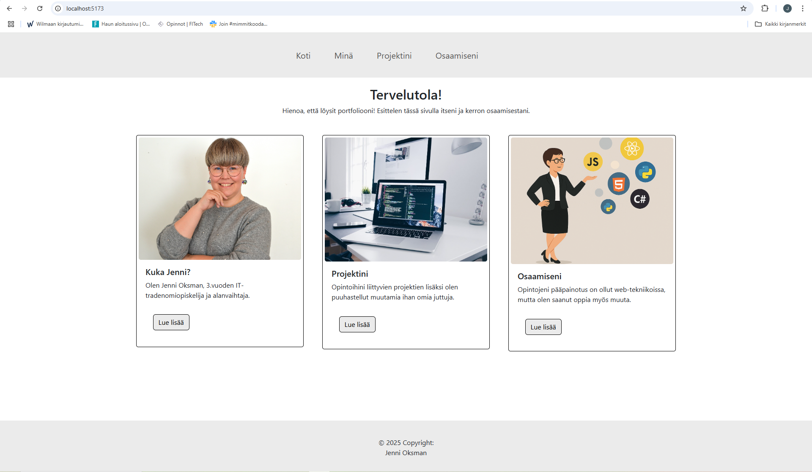
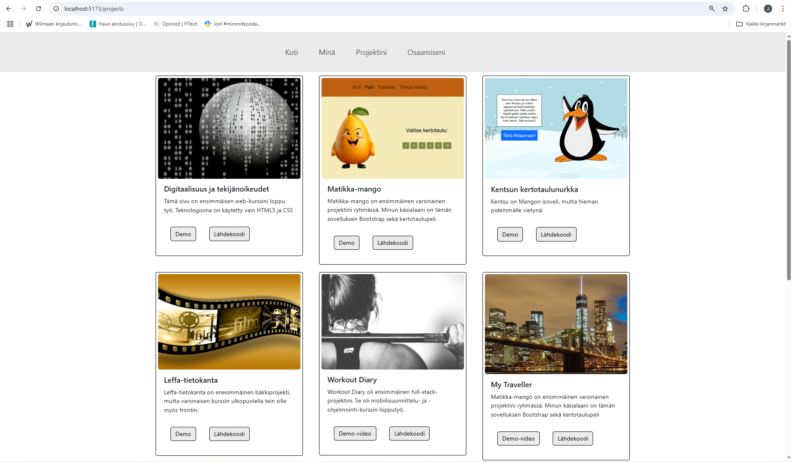

# 💻 Portfolio

Tervetuloa henkilökohtaiseen portfoliooni! 👋 Tämä projekti esittelee osaamistani web-kehityksen, ohjelmoinnin ja IT-alan opintojen parista. Sivusto on vielä keskeneräinen. Se on rakennettu Reactilla ja Bootstrapilla, ja siinä hyödynnetään responsiivista suunnittelua sekä komponenttipohjaista arkkitehtuuria.

# 🧰 Teknologiat ja työkalut
[](https://skillicons.dev)

---

## 📌 Sisältö

Sivustolta löydät:

- 🧍 **Kuka Jenni?** – lyhyt esittely minusta ja opiskeluistani.
- 🧠 **Osaamiseni** – taitoni ja työkalut, joita hallitsen.
- 🛠️ **Projektini** – kouluprojektit ja omat harrasteprojektit.

---

## 🔍 Näkymä

 
 
<sub>Kuvakaappaus etusivusta ja projektit-sivusta!</sub>

---

## 🚀 Asennus ja käyttö

Jos haluat testata tätä projektia paikallisesti:

```bash
git clone https://github.com/jennioksman/omaportfolio.git
cd portfolio
npm install
npm start

